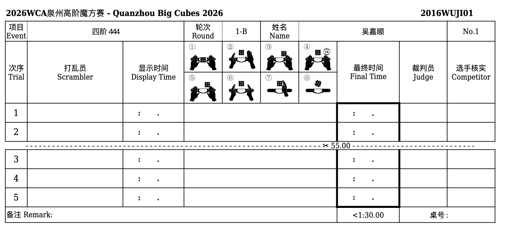
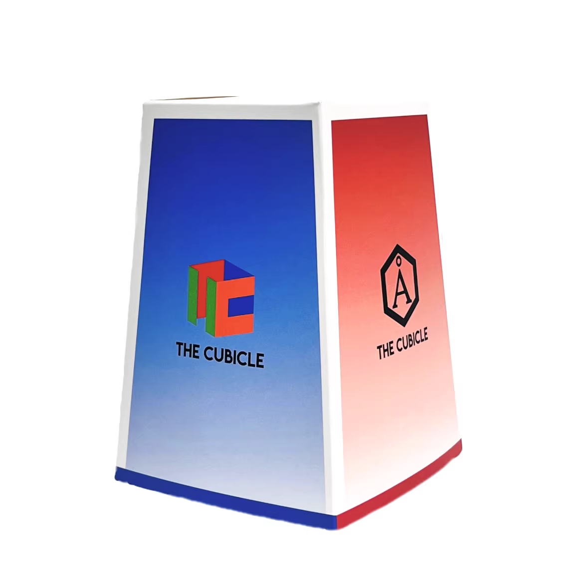
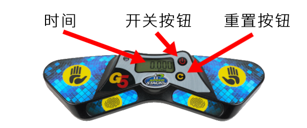
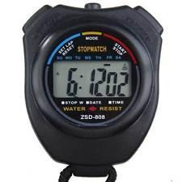
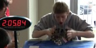
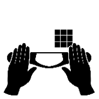
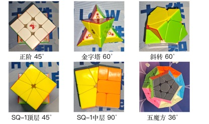
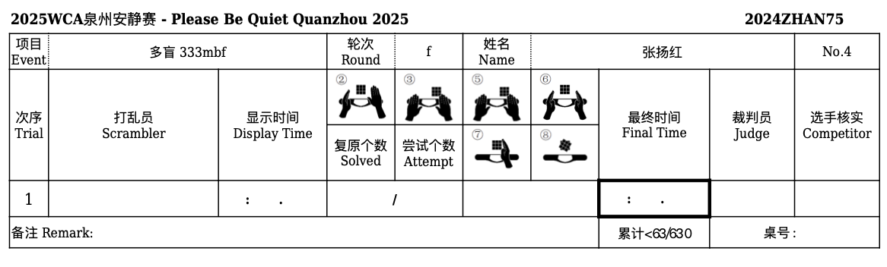

## WCA 魔方比赛

  志愿者培训

  
    GO <carbon:arrow-right />
  

  作者：泉州魔方赛事组

---
transition: fade-out
layout: two-cols
---

# 目录

**一：选手落座**

- 检查证件与成绩条
- 计时器使用教学

**二：打乱**

- 监督打乱员签名
- 保持遮挡盒关闭

**三：还原开始前**

- 计时器检查
- 观察阶段计时

**四：还原过程中**

- 观察违规行为
- 及格线与还原时限

::right::

**五：还原结束**

- 成绩记录与签字

**判罚说明**

- 还原开始前判罚（①-④）
- 还原结束后判罚（⑤-⑧）

**特殊项目**

- 盲拧规则
- 单手规则
- 魔表规则
- 长项目规则

**其他情况**

- 录像设备
- 时间记录

---
layout: two-cols
---

# 一：选手落座

## 检查要点

- 确认选手参赛证件与成绩条信息一致
- 确认成绩条上是否印有十位 WCA ID
- WCA ID 格式：`2016WUJI01`（4 位数字 + 4 位字母 + 2 位数字）

::right::

## 需要检查的内容

1. **项目与轮次**是否与当前轮次一致
2. **选手姓名与编号**是否与参赛证件一致

## 特殊情况处理

若成绩条上**没有 WCA ID**，请先询问选手是否会使用计时器。

若选手不会使用，可用以下话术引导：

> 「双手手指放在计时器感应区；待红绿灯均亮起后松手开始计时；还原结束后，双手再次触碰感应区停止计时。」

---

# 一：选手落座

## 准备工作

- 若选手携带**多个魔方**，请询问本次使用哪一个，并将其带至打乱区
- 在成绩条**右下角**标注桌号
- 将成绩条夹在夹板上，与选手魔方、遮挡盒一并带至打乱区

<v-clicks>

- ✓ 检查证件
- ✓ 确认魔方
- ✓ 标记桌号
- ✓ 带到打乱区

</v-clicks>

---
layout: two-cols
---

# 二：打乱

## 打乱流程

- 请务必监督打乱员完成签名
- 请时刻留意对应打乱员，避免拿错成绩条或魔方

## 重要提醒

打乱后请保持**遮挡盒始终盖在魔方上**，不要打开，随后将其带回赛台。

  ⚠️ 回到赛台后，请将遮挡盒连同内部魔方从夹板「滑」至选手面前，<strong class="text-red-600">切勿提前打开遮挡盒</strong>。

::right::

---

# 三：还原开始前

## 计时器检查

检查计时器是否已开机并清零（应为 **2-PAD 模式**）

### 按键说明

- **开关键**：若显示屏未亮起，按此键开机
- **清零键**：每次还原开始前确认计时器已归零；若未归零，按此键清零（4-PAD 模式下需长按复位）

---

# 三：还原开始前

## 标准流程

### 1. 准备阶段

将带有遮挡盒的魔方置于选手面前，询问：

> **「准备好了吗？」**

选手确认准备就绪后，打开遮挡盒，并启动秒表开始观察计时。

### 2. 计时器操作

选手启动计时器（而非仅将手放上感应区）时，同步停止秒表。

### 秒表使用

- 左键：清零
- 右键：开始 / 暂停

---

# 三：还原开始前

## 观察与计时

同时观察选手与秒表。注意：观察阶段选手**不得转动魔方**。

### 时间提示

**8 秒**
 
提示「8 秒」

**12 秒**
 
提示「12 秒」

**≥ 17 秒**
 
记为 DNF（未完成）

  💡 观察时间在 15 至 17 秒之间时，**切勿提前归零秒表**。

  💡 提示时须读完整，如「8 秒」「12 秒」。

---

# 四：还原过程中

## 志愿者职责

- 📵 **全程观察**选手是否有违规行为，请勿使用手机！
- 🤫 **请勿干扰**选手比赛
- 🙅 还原过程中若出现问题，请选手**自行处理**

**散架示例（普通项目）**

**散架示例（盲拧）**

---

# 四：还原过程中

## 重要概念

### 及格线

选手须在该轮次截止前，至少有一次成绩优于（短于）及格线，方可继续参赛。

及格线标注在成绩条<strong>中间</strong>。

### 还原时限

单次还原的最长时限；超时可直接叫停，并记为 DNF。

还原时限标注在成绩条<strong>最下方</strong>。

---

# 五：还原结束

## 成绩记录

还原结束后，如实抄录计时器上的**显示时间**及**判罚编号**。

### 计算公式

最终时间 = 显示时间 + 判罚个数 × 2 秒

若还原未完成，或其他 DNF 情况，最终时间记为 **DNF**。

---
layout: default
---

# 五：还原结束

## 签字规则

### 裁判签字与选手签字

- **第一次还原**：须签 / 盖全名 ✓
- **所有有判罚的还原**：须签 / 盖全名 ✓
- **其余还原**：可签缩略名

  💡 年龄较小、尚未学会签名的选手，以及少数民族或外国友人姓名较长者，可不强制签署全名。

  💡 计时器显示多少，就抄写多少。

---
layout: two-cols
layoutClass: gap-8
---

# 说明一：判罚

## 还原开始前判罚（①-④）

①

**未将魔方放置在垫子上**

选手开始前未将魔方放置在垫子上

②

**未用手指启动计时器**

选手开始时未用手指启动计时器

③

**启动时手接触魔方**

选手启动计时器时，手接触了魔方

④

**观察时间超时**

选手观察时间超过 15 秒且未满 17 秒

::right::

## 还原结束后判罚（⑤-⑧）

⑤

**停止时手接触魔方**

还原结束、停止计时器时，手接触了魔方

⑥

**未正确停止计时器**

还原结束后，选手未以双手、手心向下平放的方式停止计时器

⑦

**停止后触碰魔方**

停止计时器后，选手触碰了魔方

⚠️ 若选手随后进行了转动，直接记为 DNF

⑧

**差一步未还原**

魔方差一步未还原（「一步」指外层转动）

---

# 关于「一步」的认定

魔方各层块转动超过临界角，即计为「一步」：

- 📅 **魔表**无需判断步数，只要未还原即记为 DNF
- ❓ 若无法判断，请举手联系现场代表或主办团队协助

---
transition: fade-out
---

# 说明二：盲拧

盲拧项目除以下要点外，其余流程与一般项目相同：

## 特殊流程

**① 自行开盖**：打乱后将魔方带回赛台，志愿者无需开盖；由选手启动计时器后自行开盖并开始计时

**② 视线遮挡**：选手戴上眼罩并开始转动魔方后（戴眼罩前可继续记忆），使用挡板遮挡选手视线与魔方

  💡 多盲项目同时适用本说明与长项目说明中的相关要求。

---
transition: fade-out
---

# 说明三：单手

单手项目除以下要点外，其余流程与一般项目相同：

## 规则要点

**① 观察时可以使用双手**

**② 只可使用同一只手**：启动计时器后，只能使用同一只手操作魔方；**中途不得换手**，否则记为 DNF

**③ 掉落处理**：还原过程中若魔方掉落或散架，只允许用**一只手**捡回或恢复魔方

---
transition: fade-out
layout: two-cols
layoutClass: gap-12
---

# 说明四：魔表

魔表项目除以下要点外，其余流程与一般项目相同：

## 特殊规则

**① 无编号 ⑧ 判罚**：魔表不设编号 ⑧ 判罚，只要未还原即记为 DNF

**② 允许操作立柱**：观察阶段允许选手操作立柱

**③ 检查背面**：还原完成后检查时，须一并检查背面

  ⚠️ 检查时勿将指向 6 点的表针误判为已还原

::right::

---
transition: fade-out
---

# 说明五：长项目

预计用时超过 10 分钟的项目，不使用计时器计时（计时器上限为 10 分钟），请使用手持秒表辅助计时。

## 计时方式

**开始计时**

选手双手手心向下放在桌面，离开桌面时开始计时

**停止计时**

选手双手手心向下拍在桌面时停止计时

---

# 说明五：长项目

## 记录格式

秒表的毫秒显示只有两位，抄写为 **「XX:XX.XX」** 格式即可。

例如：一小时应记为 `60:00.00`，而非 `1:00:00.00`。

---
layout: two-cols
layoutClass: gap-8
---

# 说明五：长项目

## 多盲项目

**务必在选手确认开始时启动计时**（若使用秒表计时）。

**DNF 判断标准**

- ① 还原 1 个，尝试 2 个
- ② 还原 − (尝试 − 还原) < 0

::right::

**还原时限**

- ① 尝试 > 5：60 min
- ② 尝试 ≤ 5：尝试 × 10 min

  💡 若选手选择使用计时器，成绩仍写三位小数；考虑到用时可能超过 10 分钟，建议同步启动秒表。

---
transition: fade-out
---

# 说明六：其他情况

## 录像设备

若选手使用相机、手机或其他录影设备，须确保选手**无法看到屏幕**（可将屏幕背对选手，或直接遮挡屏幕）。

若手机不用于录像，须**摄像头朝上**放置在垫子外。

选手全程**禁止佩戴耳机**（请注意区分耳罩与头戴式耳机，耳罩可佩戴）。

---

# 说明六：其他情况

## 时间记录

抄写时间时，请务必抄录**计时器屏幕显示的时间**，而非计时器背面的时间，并按 **「分钟:秒钟.毫秒」** 格式记录，例如：`12:34.56`。

## 下次尝试处理

若选手未还原（DNF / DNS / 备用打乱等）且需进行下一次尝试，请让选手**自行还原魔方**后，再带至打乱区重新打乱。

  💡 若监督代表给出备用打乱，建议在打乱时提醒打乱员使用备打 1 / 备打 2。

---
layout: center
class: text-center
---

# 重要提醒

遇到无法自行处理的情况，请**保护好现场**，举手示意代表或主办团队介入处理。

  🙋‍♂️

---
layout: center
class: text-center
---

# 谢谢

## 感谢各位志愿者

如有疑问，请及时联系主办团队或代表。

---
layout: center
---

# 引用

**WCA 官方规则（Regulations）**

[https://www.worldcubeassociation.org/regulations/](https://www.worldcubeassociation.org/regulations/)

**WCA 官方规则（中文版）**

[https://www.worldcubeassociation.org/regulations/translations/chinese/](https://www.worldcubeassociation.org/regulations/translations/chinese/)

本培训内容依据 WCA 官方规则整理，具体执裁以现场代表或主办团队指示为准。

感谢 **北京魔方赛事组委会** 与 **泉州魔方赛事组** 对本培训材料的支持。

如有问题，请联系：吴嘉顺 jwu@worldcubeassociation.org

